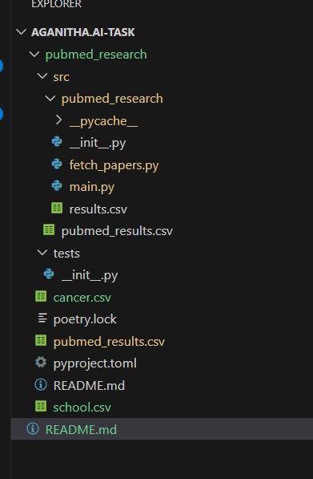

# PubMed Research Paper Filtering Project - Summary

---

## Objective:

The project is a **Python-based command-line tool** that searches PubMed for research papers and filters out those authored by individuals affiliated with pharmaceutical or biotech companies. The results are saved in a CSV file or displayed on the terminal.

---

## What This Project Does

Takes a **search query** as user input (e.g., "Cancer treatment").

Fetches research papers from the **PubMed database** 
using the PubMed API.

Extracts paper details, including title, publication date, authors, affiliations, and emails.

Filters **out non-academic authors** based on their affiliations (checks for keywords like "Inc.", "Ltd.", "Pharma", "Biotech", "Corporation").

Displays the results on the terminal or saves them as a CSV file based on user preference.

## Technologies Used

 **Python** – Main programming language.
 **PubMed API** – Used to fetch research papers.
 **Poetry** – For dependency management and virtual environment.
 P**andas** – To store and save data in a structured format.
 **Git & GitHub** – For version control.

## How It Works?

 User runs the script and enters a search term (e.g., "Cancer Research").

 The program fetches a list of relevant PubMed IDs from the API.

 It retrieves detailed paper information, including authors and affiliations.

 The script identifies non-academic authors by checking if they are affiliated with companies.

 The filtered results are displayed on the terminal or saved as a CSV file.

## Key Features & Enhancements
 **User-friendly input** – Instead of command-line arguments, we allow the user to enter the search term interactively.
 **Debug mode** – Optional mode that prints additional logs for troubleshooting.
 **Strict adherence to clean code and best practices** – We followed proper argument parsing and modular design for maintainability.
 **Company keyword filtering** – We used a heuristic approach to identify **industry**-affiliated authors based on affiliation keywords.

## Setup Project:
### Clone the Repository
**git clone** (https://github.com/Madhumithaashanmugam/Aganitha-task.git)
cd pubmed_research
**Install Python and Poetry**
pip install poetry
**verify the installation**
poetry --version
I**nstall Dpendances:**
poetry install

## File strucer:

**run project**
poetry run python src/pubmed_research/main.py

Enter the search query in my case it is office
when you hit enter the updated data will be stored in the csv file

or if you want to store that in diffent file you can go with command.
poetry run python src/pubmed_research/fetch_papers.py

Here it we need to give the input of query search
again it will ask about debug mode we want to select y/n
and it will as about the file save details.

